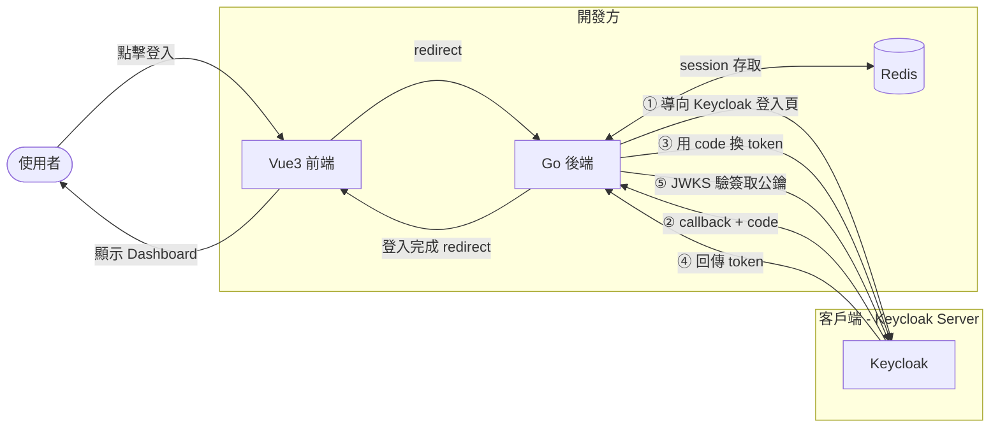
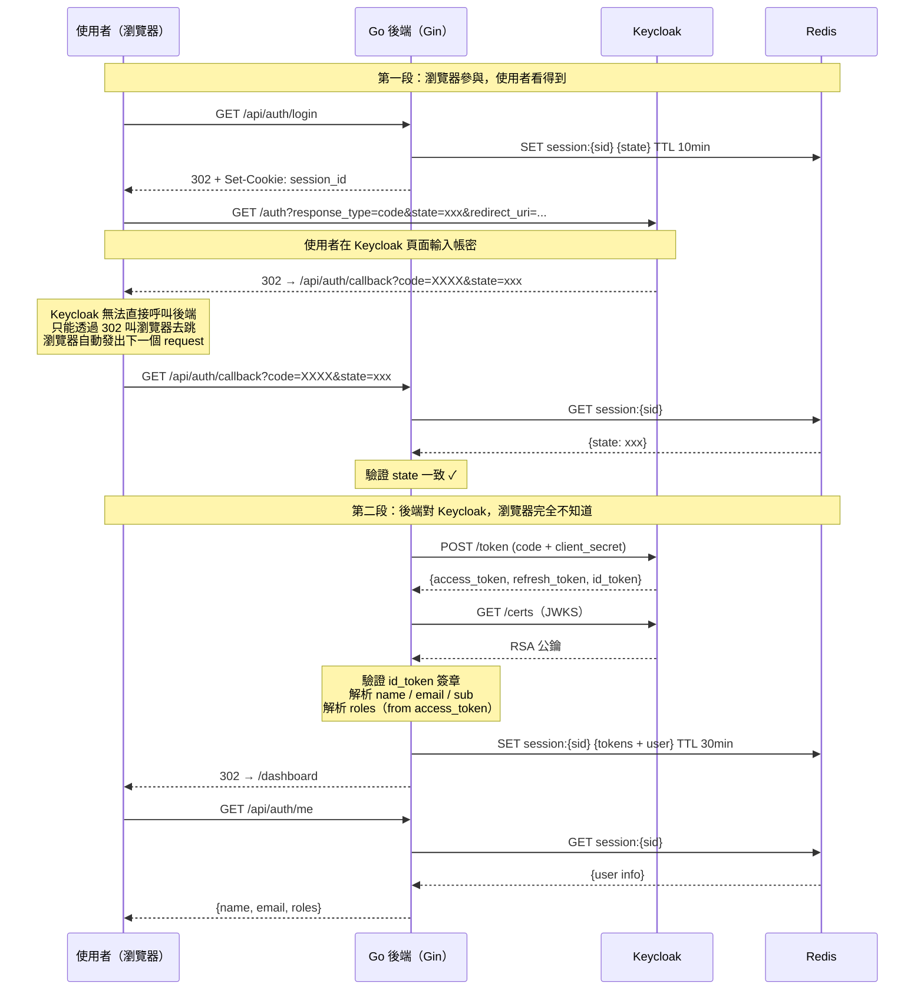
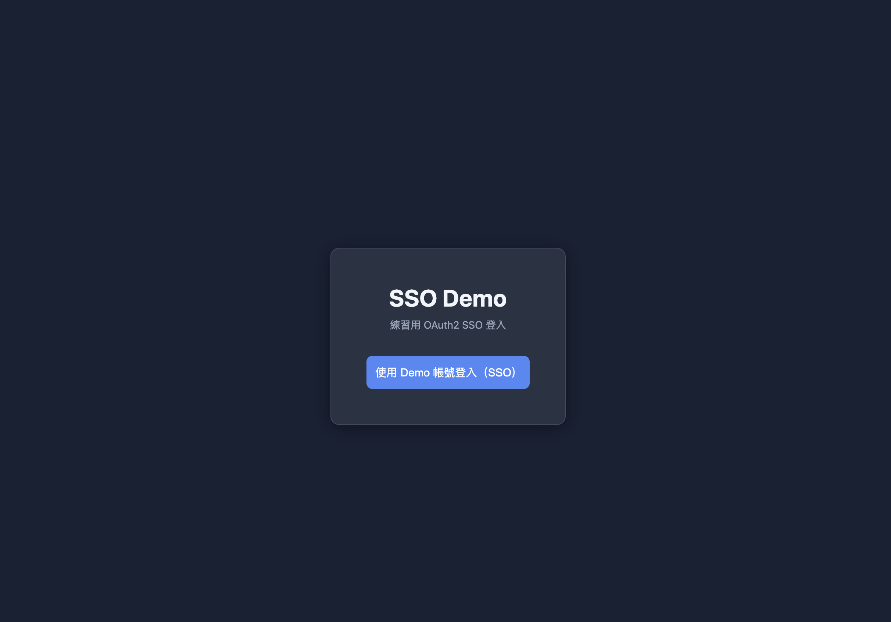
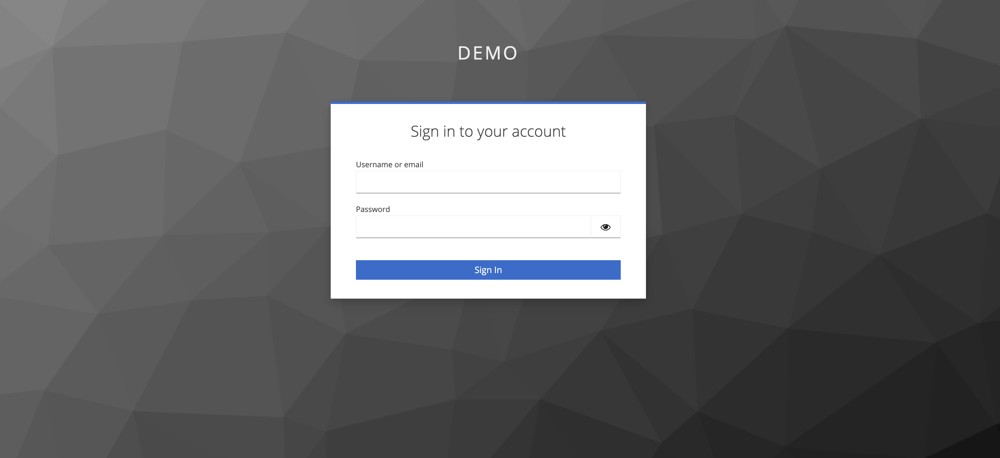
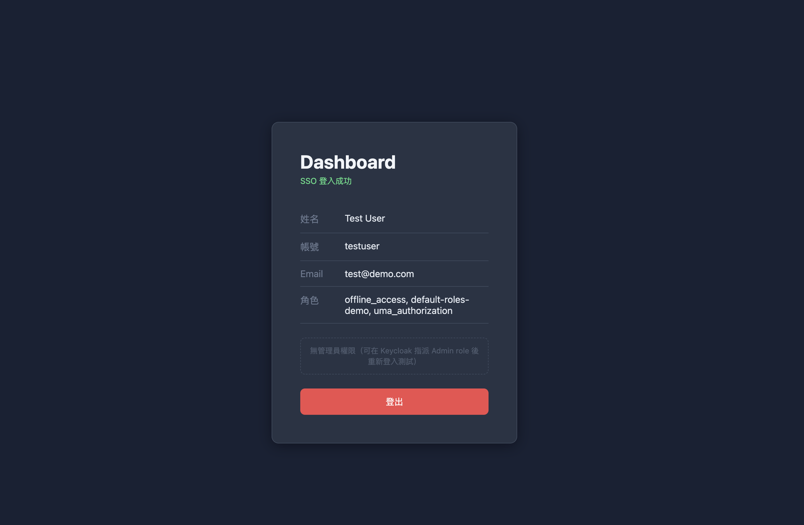
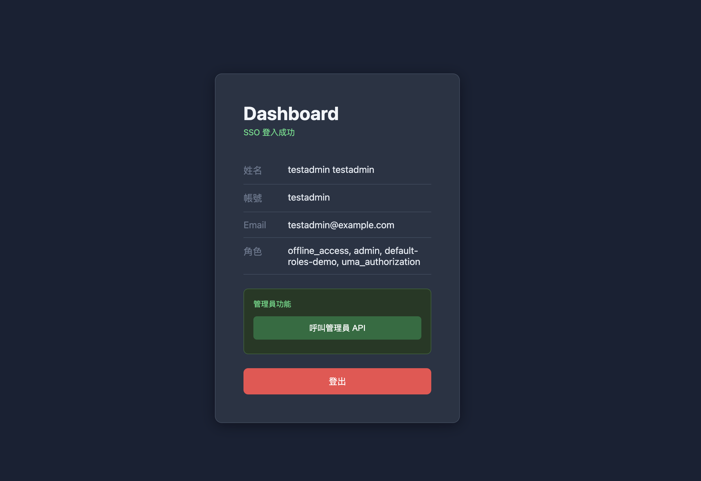
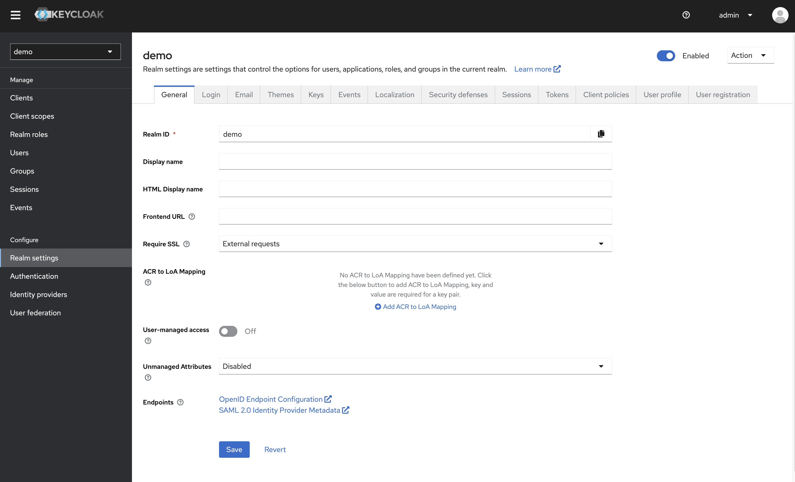
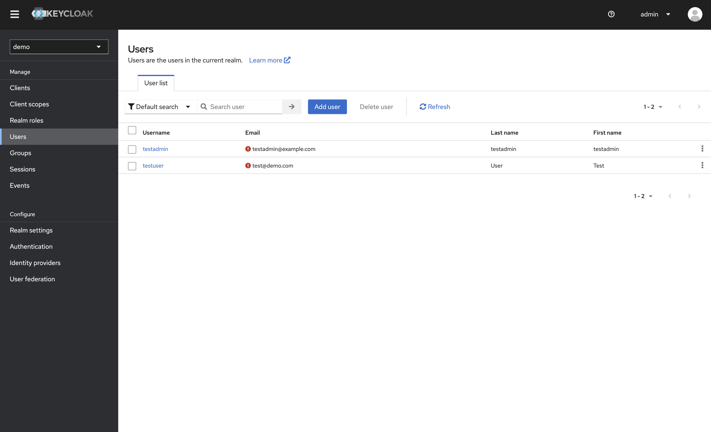
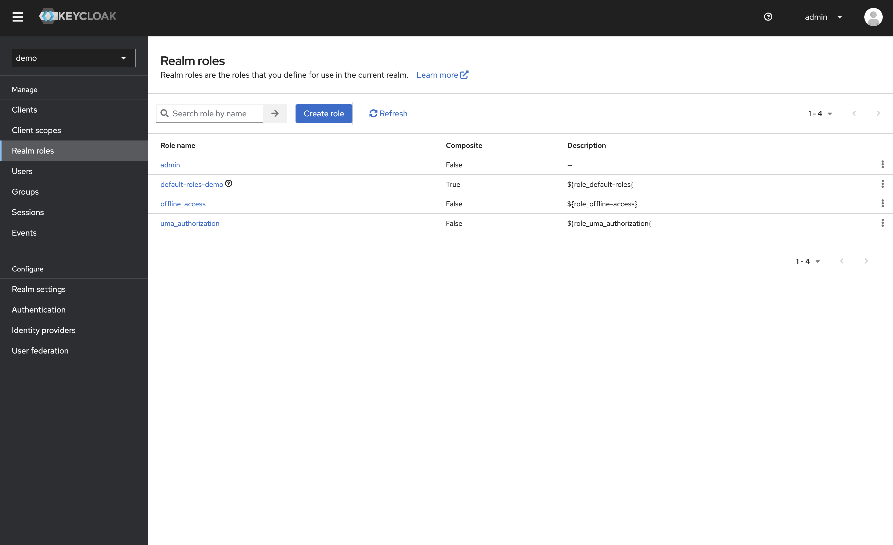
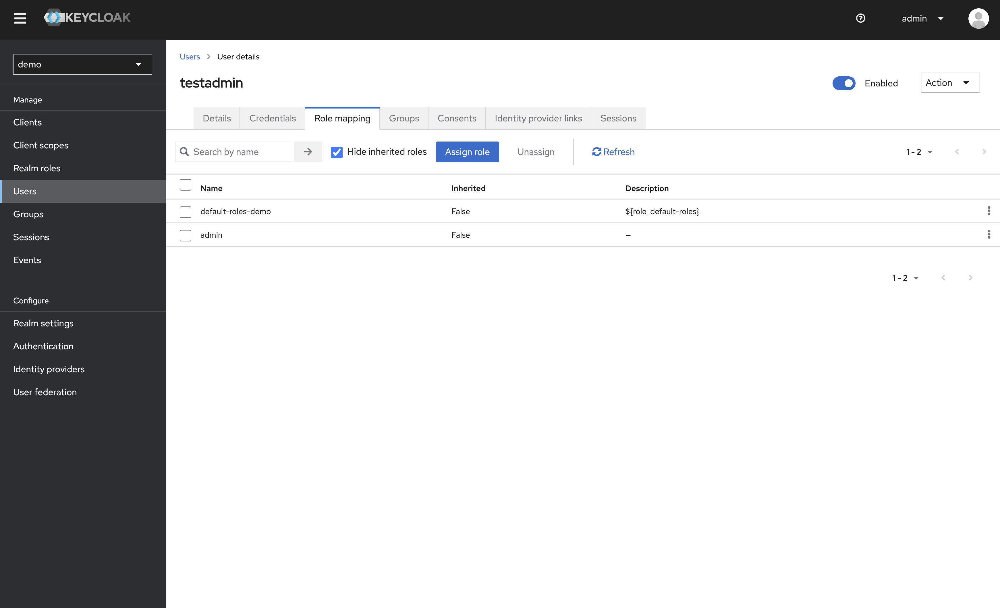

# oauth2-sso-demo

OAuth2 Authorization Code Flow SSO 實作練習，本機以 Keycloak 模擬正式授權伺服器的完整流程。

---

## 架構圖

```
Browser (localhost:5173)
    |
    | /api/* → proxy
    |
Vue3 Frontend (Vite dev server)
    |
    | HTTP
    |
Go Backend / Gin (localhost:8081)
    |          |
    |          +---> Redis (localhost:6379)   session storage
    |
    +---> Keycloak (localhost:8080)           OAuth2 / OIDC server
              |
              +--- Realm: demo
                      |
                      +--- Client: demo
                      +--- Roles: admin
                      +--- Users: testuser, testadmin
```

---

## 登入流程

### 簡易版：系統邊界與主要互動



> 實務上，開發方負責 Frontend + Backend，客戶只需提供 Keycloak Server 的 URL 與憑證（Client ID / Secret）。換掉 `.env` 即可對接正式環境。

---

### 細部版：完整 Sequence Diagram



---

### 段落一：觸發登入 — 產生 state，導向 Keycloak

使用者點「SSO 登入」後，瀏覽器打後端 `GET /api/auth/login`。  
這支 API 本身不顯示任何東西，做完就把瀏覽器導走，使用者感覺不到它的存在。

後端做兩件事：
1. 產生隨機 `state` 和 `session_id`，把 state 存進 Redis（TTL 10 分鐘）
2. 把 Keycloak 的登入 URL 組出來，帶著 session_id cookie 把瀏覽器 302 導過去

組出來的 URL 長這樣：

```
GET http://localhost:8080/realms/demo/protocol/openid-connect/auth
  ?response_type=code
  &client_id=demo
  &scope=openid
  &state={{RANDOM_STATE}}
  &redirect_uri=http://localhost:8081/api/auth/callback
```

| 參數 | 說明 |
|------|------|
| `state` | 後端自產的隨機字串，存在 Redis，callback 時用來確認這個請求是由本系統發起的 |
| `redirect_uri` | 登入完成後 Keycloak 要把瀏覽器導回哪裡，這裡指向後端 |

使用者看到的：畫面直接跳到 Keycloak 的登入頁面。

---

### 段落二：使用者在 Keycloak 登入，code 被帶回後端

這個 Keycloak 登入頁是**客戶端的頁面**，不是開發方自己的 UI。  
使用者在上面輸入帳號密碼，Keycloak 驗證成功後產生一次性的 `code`。

Keycloak 沒辦法直接呼叫後端，只能透過 302 叫瀏覽器去跳。  
瀏覽器收到 302 後自動打：

```
GET http://localhost:8081/api/auth/callback
  ?code=XXXX
  &state=剛才的隨機字串
```

code 就這樣被瀏覽器帶回到後端，整個過程使用者不需要做任何事。

> `code` 只能用一次，且有短暫時效，必須馬上換成 token。

---

### 段落三：比對 state，用 code 換 token

後端收到 callback，從 cookie 拿 `session_id`，去 Redis 找對應的 state，  
跟 URL 上帶回來的 state 比對，確認這個 callback 真的是由本系統的 login 發起的。

比對 OK 後，後端去 call Keycloak 的 `/token` API：

```
POST http://localhost:8080/realms/demo/protocol/openid-connect/token
Content-Type: application/x-www-form-urlencoded

grant_type=authorization_code
&client_id=demo
&client_secret={{CLIENT_SECRET}}
&redirect_uri=http://localhost:8081/api/auth/callback
&code=XXXX
```

`client_secret` 是客戶事先提供的暗號，Keycloak 用它確認這個請求是合法的 client。  
這整段都在後端執行，瀏覽器完全不知道，`client_secret` 不會暴露出去。

Keycloak 確認後回傳：

```json
{
  "access_token": "eyJ...",
  "refresh_token": "eyJ...",
  "id_token": "eyJ...",
  "expires_in": 300
}
```

| 欄位 | 說明 |
|------|------|
| `id_token` | 使用者身份資訊（name、email、sub），JWT 格式 |
| `access_token` | 授權資訊（`realm_access.roles`），JWT 格式 |
| `refresh_token` | access_token 快過期時用來靜默換新，不用讓使用者重新登入 |

---

### 段落四：驗簽，確認 token 是真的 Keycloak 給的

拿到的 token 不是普通 JSON，是 JWT 格式（三段用 `.` 分隔）：

```
eyJhbGc...   .   eyJzdWIi...   .   SflKxwR...
  header     .     payload     .    signature
```

payload Base64 解碼後就是使用者資訊，但不能直接信任它——任何人都可以自己偽造一個 JWT 塞假資料進去。

所以需要去 call Keycloak 的 `/certs` API 拿 RSA 公鑰，  
用這把公鑰驗 JWT 第三段的 signature，確認這個 token 真的是 Keycloak 簽的、沒有被竄改。

驗過之後才信任 payload，解析出：

```
id_token  payload → sub / name / email（使用者是誰）
access_token payload → realm_access.roles（使用者能做什麼）
```

> roles 在 access_token，不在 id_token，要分開解析。  
> RSA 公鑰會快取 1 小時，不是每次都打 Keycloak。

---

### 段落五：存進 Redis，導回前端

驗簽完成，後端把 user info + tokens 一起存進 Redis（session_id 為 key，TTL 30 分鐘），  
再把瀏覽器 302 導向前端 `/dashboard`。

前端載入後打 `GET /api/auth/me`，後端從 cookie 拿 session_id，去 Redis 撈資料回傳。  
前端拿到 user info 後依 roles 判斷要不要顯示管理員區塊。

> `/api/auth/me` 只負責讀，不寫任何資料。之後每次重整頁面，前端都會打一次它確認登入狀態還在。

---

## Screenshots

### 前端

| 登入頁 | Keycloak 登入頁 |
|--------|----------------|
|  |  |

| Dashboard（一般用戶） | Dashboard（Admin） |
|----------------------|-------------------|
|  |  |

### Keycloak 設定

| Realm 設定 | Client 設定（Redirect URIs） |
|-----------|---------------------------|
|  |  |

| User 列表 | Role 列表 | testadmin Role Mapping |
|----------|----------|----------------------|
|  |  |  |

---

## 使用工具

| 工具 | 用途 |
|------|------|
| **Keycloak 24** | 本機 OAuth2 / OIDC server，模擬正式環境的授權伺服器 |
| **Go + Gin** | 後端 HTTP server，處理 OAuth2 流程與 session 管理 |
| **go-redis** | 將 session 存入 Redis，支援多實例與自動 TTL 過期 |
| **Vue3 + Vite** | 前端，Vite proxy 解決跨域問題 |
| **Vue Router** | 前端路由，含 navigation guard 保護需登入頁面 |
| **Pinia** | 前端全域登入狀態管理 |
| **Docker Compose** | 一鍵啟動 Keycloak + Redis |

---

## 專案結構

```
oauth2-sso-demo/
├── docker-compose.yml
├── docs/
│   └── screenshots/
├── backend/
│   ├── main.go
│   ├── .env
│   ├── config/
│   │   └── config.go        讀取環境變數
│   ├── handler/
│   │   └── auth.go          /login /callback /logout /me /admin/data
│   ├── middleware/
│   │   └── auth.go          TokenRefresh、RequireRole
│   ├── jwks/
│   │   └── jwks.go          從 Keycloak 取公鑰並快取，用於 JWT 驗簽
│   └── store/
│       └── session.go       Redis session 存取
└── frontend/
    └── src/
        ├── stores/
        │   └── auth.js      Pinia，管理登入狀態
        ├── router/
        │   └── index.js     路由 + navigation guard
        └── views/
            ├── LoginView.vue
            └── DashboardView.vue
```

---

## 環境變數（backend/.env）

| 變數 | 說明 | 範例 |
|------|------|------|
| `KEYCLOAK_BASE` | Keycloak realm 的 OIDC base URL | `http://localhost:8080/realms/demo/protocol/openid-connect` |
| `CLIENT_ID` | Keycloak client ID | `demo` |
| `CLIENT_SECRET` | Keycloak client secret（從 Credentials 分頁取得） | `xxxxxx` |
| `REDIRECT_URI` | OAuth callback，指向後端 | `http://localhost:8081/api/auth/callback` |
| `POST_LOGOUT_URI` | 登出後跳回的網址 | `http://localhost:5173/` |
| `FRONTEND_URL` | 後端登入完成後導向前端的 base URL | `http://localhost:5173` |
| `REDIS_URL` | Redis 連線字串 | `redis://localhost:6379` |

---

## 啟動方式

### 1. 啟動 Keycloak + Redis

```bash
docker compose up -d
docker compose ps   # 確認兩個都是 healthy
```

---

### 2. Keycloak 初始設定（第一次需要）

開瀏覽器進 `http://localhost:8080`，帳密 `admin / admin`

```
建立 Realm：demo

建立 Client：
  Client ID: demo
  Client authentication: ON
  Valid redirect URIs: http://localhost:8081/api/auth/callback
  Post logout redirect URIs: http://localhost:5173/
  Web origins: http://localhost:5173

建立 Role：admin（Realm roles → Create role）

建立 User：
  testuser   → 不指派任何 role
  testadmin  → Role mapping 指派 admin role
  Credentials → Set password（Temporary: OFF）
```

---

### 3. 設定 backend/.env

建立 `backend/.env`，將 Keycloak `Clients → demo → Credentials → Client secret` 填入 `CLIENT_SECRET`：

```env
KEYCLOAK_BASE=http://localhost:8080/realms/demo/protocol/openid-connect
CLIENT_ID=demo
CLIENT_SECRET=（從 Keycloak Credentials 分頁複製）
REDIRECT_URI=http://localhost:8081/api/auth/callback
POST_LOGOUT_URI=http://localhost:5173/
FRONTEND_URL=http://localhost:5173
REDIS_URL=redis://localhost:6379
```

---

### 4. 啟動 Go 後端

```bash
cd backend
go run main.go
# Listening and serving HTTP on :8081
```

---

### 5. 啟動 Vue3 前端

```bash
cd frontend
npm install
npm run dev
# http://localhost:5173
```

---

## API

| Method | 路徑 | 保護 |
|--------|------|------|
| `GET` | `/api/auth/login` | — |
| `GET` | `/api/auth/callback` | — |
| `GET` | `/api/auth/logout` | — |
| `GET` | `/api/auth/me` | session |
| `GET` | `/api/admin/data` | session + admin role |

---

### GET /api/auth/login

**觸發時機**：使用者點「SSO 登入」按鈕  
**後端做什麼**：產生 state + session_id → 存 Redis → 組 Keycloak auth URL → 302 redirect  
**使用者看到**：畫面直接跳到 Keycloak 登入頁，這支 API 本身不顯示任何東西

---

### GET /api/auth/callback

**觸發時機**：使用者在 Keycloak 登入成功後，由 Keycloak 透過瀏覽器 302 自動觸發  
**後端做什麼**：
1. 從 Redis 讀 state，與 URL 上的 state 比對
2. POST /token 給 Keycloak，用 code + client_secret 換 token
3. GET /certs 拿公鑰，驗 id_token 的 JWT 簽章
4. 解析 id_token 取 name / email / sub，解析 access_token 取 roles
5. 把完整 session 存進 Redis（TTL 30 分鐘）
6. 302 redirect 前端 /dashboard

**使用者看到**：這支 API 也不顯示任何東西，瀏覽器直接被導向前端

---

### GET /api/auth/logout

**觸發時機**：使用者點「登出」按鈕  
**後端做什麼**：清除 Redis session → 清除 cookie → redirect Keycloak 登出 URL  
**使用者看到**：Keycloak 完成全域登出後，被導回前端首頁

> 若只清 session 不通知 Keycloak，使用者在其他串接系統仍保持登入，無法達到 SSO 全域登出。

---

### GET /api/auth/me

**觸發時機**：前端每次進入 /dashboard 或重整頁面  
**後端做什麼**：從 cookie 拿 session_id → 去 Redis 撈 user info → 回傳 JSON  
**注意**：只負責讀，不寫任何資料。登入狀態存在 Redis，這支 API 只是讀出來給前端用

```json
{
  "sub": "使用者唯一 ID",
  "name": "Test User",
  "username": "testuser",
  "email": "test@demo.com",
  "roles": ["offline_access", "admin", "default-roles-demo", "uma_authorization"]
}
```

---

### GET /api/admin/data

**觸發時機**：前端點「呼叫管理員 API」  
**保護**：RequireRole middleware 檢查 session 的 roles 是否包含 admin 或 advanced（大小寫不限），沒有直接回 403  
**後端做什麼**：通過驗證後回傳管理員專屬資料

---

## 核心概念

**Token Refresh（靜默換新）**

每個 request 進來時，後端 middleware 檢查 access_token 是否快過期（剩不到 60 秒）。快過期就用 refresh_token 向 Keycloak 換新 token 並更新 Redis，使用者完全感知不到。

**Session 為什麼存 Redis 不存記憶體？**

記憶體 session 在 server 重啟或多實例部署時會消失。Redis 有 TTL 自動過期（30 分鐘），且多台 server 共享同一份 session。

**Vite proxy 的作用**

前端呼叫 `/api/auth/me`，Vite dev server 把這個 request 轉發到 `localhost:8081`，避免瀏覽器的跨域（CORS）限制，同時 cookie 也能正確帶上。

---

## 踩過的坑

**1. Keycloak healthcheck 打錯 port**

Keycloak 24 的 `/health/ready` 是在 management port 9000，不是 8080。但 `start-dev` 模式根本不開 9000，最後改用 bash 的 `/dev/tcp` 直接打 HTTP request 到 8080 來做 healthcheck。

**2. `docker restart` 不會套用新設定**

更新 `docker-compose.yml` 後用 `restart` 無效，必須 `docker compose down && docker compose up -d` 才會重建 container 套用新設定。

**3. `CMD-SHELL` 用 `/bin/sh`，不是 bash**

Docker healthcheck 的 `CMD-SHELL` 預設走 `/bin/sh`，但 `/dev/tcp` 是 bash 專屬語法。改成 `["CMD", "bash", "-c", "..."]` 才能正常執行。

**4. Volume 加入時機**

第一次啟動沒有 volume，Keycloak 設定存在 container 內部。後來加了 volume 重建 container，新的空 volume 蓋掉原本的設定，導致 realm 消失。需要在加 volume 後重新設定一次，之後才會持久化。

**5. Redirect URI 要指向後端**

原本 `REDIRECT_URI` 設成前端的 `localhost:5173/callback`，導致 Keycloak 把 code 送到前端，但前端沒跑起來就拒絕連線。改成直接指向後端 `localhost:8081/api/auth/callback`，由後端接收 code 並處理。

**6. roles 在 access_token，不在 id_token**

`realm_access.roles` 只存在 access_token，id_token 不帶 roles。一開始只解析 id_token 導致 roles 永遠是空的，需要另外 parse access_token 來取 roles。

**7. Role 比對要 case-insensitive**

Keycloak role 名稱是 `admin`（小寫），但程式碼寫的是 `"Admin"`，導致前端判斷顯示異常、後端 API 永遠 403。前端用 `.toLowerCase()` 比對，後端改用 `strings.EqualFold()` 解決。

---

## 關於這個專案

為了理解 OAuth2 Authorization Code Flow 實際運作而建的練習專案。本機以 Keycloak 模擬正式環境的授權伺服器，換掉 `.env` 的 URL 即可對接正式環境。

開發過程以 [Claude Code](https://claude.ai/code) 輔助。
